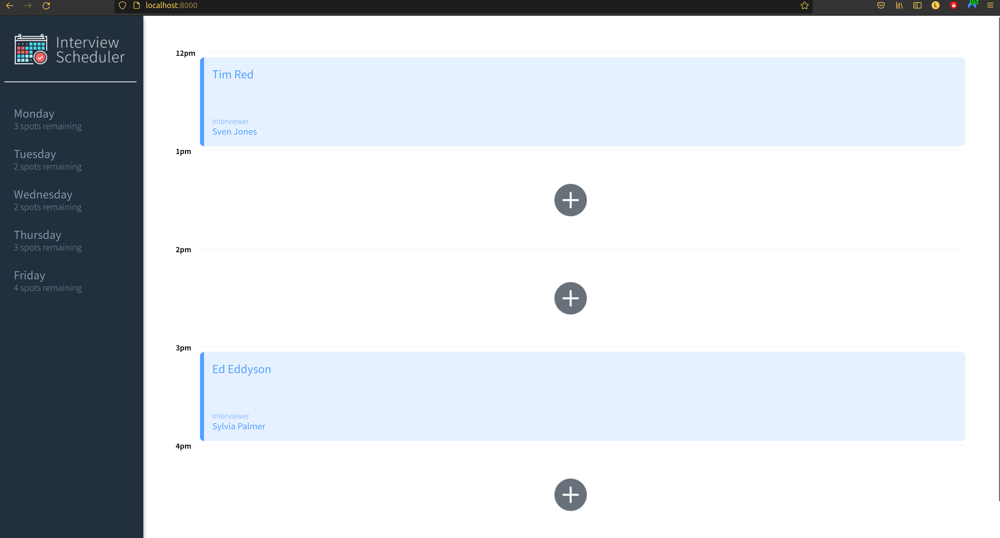
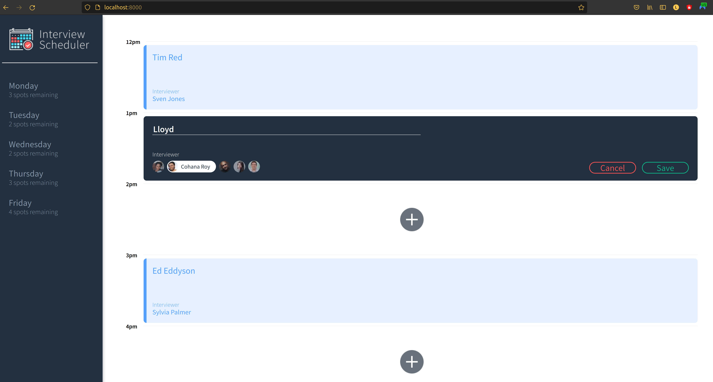
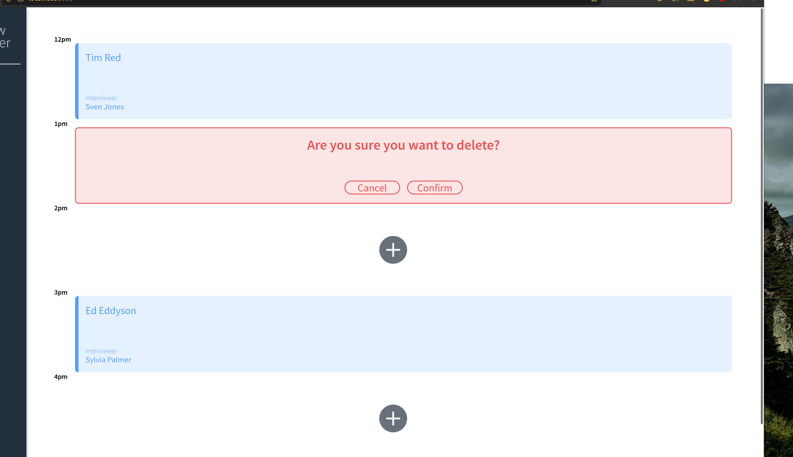
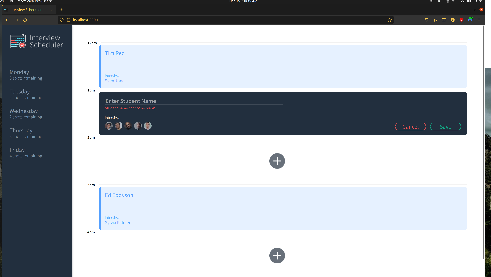

# Interview Scheduler

## Welcome to my React Project

Scheduler is a front-end app built using React.js and Storybook. Scheduler provides the front-end functionaltiy to schedule one-on-one interviews between students and instructors.

## Setup

Install dependencies with `npm install`.

## Running Webpack Development Server

```sh
npm start
```

## Running Jest Test Framework

```sh
npm test
```

## Running Storybook Visual Testbed

```sh
npm run storybook
```

## Screenshots





